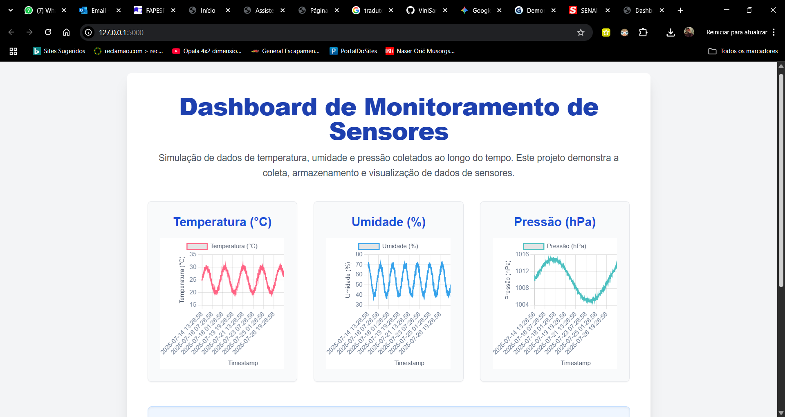

# DashBoard_Sensorial

Uma breve descrição sobre o que esse projeto faz e para quem ele é


## Documentação

# Dashboard de Monitoramento de Sensores


Um projeto de portfólio que simula a coleta, armazenamento e visualização de dados de telemetria de sensores. Esta aplicação web utiliza uma API backend em Python (Flask) para servir os dados a uma interface interativa construída com HTML, Tailwind CSS e Chart.js.

---

## 📖 Tabela de Conteúdos

* [Sobre o Projeto](#-sobre-o-projeto)
* [✨ Principais Funcionalidades](#-principais-funcionalidades)
* [🖼️ Screenshot do Dashboard](#-screenshot-do-dashboard)
* [🛠️ Tecnologias Utilizadas](#️-tecnologias-utilizadas)
* [🚀 Como Executar o Projeto](#-como-executar-o-projeto)
* [📄 Licença](#-licença)
* [📧 Contato](#-contato)

---

## 🎯 Sobre o Projeto

Este projeto foi desenvolvido como uma demonstração prática de habilidades full-stack para um portfólio de TI, com foco em tecnologias relevantes para ambientes de pesquisa e desenvolvimento como a CNPEM.

O objetivo é simular um cenário real onde dados de múltiplos sensores (temperatura, umidade e pressão) são coletados continuamente, salvos em um banco de dados e exibidos em tempo real em um dashboard amigável. A aplicação demonstra a capacidade de manipular dados, construir uma API e criar uma interface de usuário clara e funcional.

---

## ✨ Principais Funcionalidades

* **Simulação de Dados:** Geração de dados realistas de sensores usando as bibliotecas `NumPy` e `Pandas`.
* **Armazenamento de Dados:** Persistência dos dados em um banco de dados leve e eficiente, o `SQLite`.
* **API RESTful:** Uma API backend construída com `Flask` que expõe um endpoint (`/api/data`) para fornecer os dados ao frontend.
* **Visualização Interativa:** Gráficos de linha dinâmicos e responsivos criados com `Chart.js` para exibir a telemetria ao longo do tempo.
* **Interface Moderna:** O frontend é estilizado com `Tailwind CSS`, garantindo um design limpo e responsivo que se adapta a diferentes tamanhos de tela.

---

## 🖼️ Screenshot do Dashboard


---

## 🛠️ Tecnologias Utilizadas

### Backend
* **Linguagem:** `Python 3.9+`
* **Framework API:** `Flask`
* **Banco de Dados:** `SQLite`
* **Manipulação de Dados:** `Pandas`, `NumPy`

### Frontend
* **Estrutura:** `HTML5`
* **Estilização:** `Tailwind CSS`
* **Visualização de Dados:** `Chart.js`

---

## 🚀 Como Executar o Projeto

Siga os passos abaixo para ter uma cópia do projeto rodando localmente.

### Pré-requisitos

* Python 3.9 ou superior
* Pip (gerenciador de pacotes do Python)

### Instalação

1.  **Clone o repositório:**
    ```bash
    git clone https://github.com/ViniSaraujo/DashBoard_Sensorial
    ```

2.  **Navegue até o diretório do projeto:**
    ```bash
    cd main.py
    ```

3.  **(Recomendado) Crie e ative um ambiente virtual:**
    ```bash
    # Para Windows
    python -m venv venv
    .\venv\Scripts\activate

    # Para macOS/Linux
    python3 -m venv venv
    source venv/bin/activate
    ```

4.  **Instale as dependências do Python:**
    ```bash
    pip install Flask pandas
    ```

### Executando a Aplicação

A aplicação requer dois processos rodando simultaneamente em terminais diferentes.

1.  **Terminal 1: Gerar os dados e iniciar o servidor da API**
    No seu terminal, execute o `api.py`. Este script irá primeiro gerar os dados simulados (se o banco de dados não existir) e depois iniciar o servidor web.
    ```bash
    python api.py
    ```
    Você deverá ver uma mensagem indicando que o servidor Flask está rodando em `http://127.0.0.1:5000`.

2.  **Abra o Dashboard no Navegador**
    Abra o seu navegador de internet e acesse a seguinte URL:
    ```
    [http://127.0.0.1:5000/](http://127.0.0.1:5000/)
    ```
    O dashboard deverá carregar e exibir os gráficos com os dados dos sensores.

---

## 📄 Licença

Este projeto está sob a licença MIT. Veja o arquivo `LICENSE.md` para mais detalhes.

---

## 📧 Contato

**[Seu Nome]**

* **LinkedIn:** `https://www.linkedin.com/in/vinicius-araujo-13b75b156/`
* **E-mail:** `vinicius-araujo99@hotmail.com`
* **Link do Projeto:** `https://github.com/ViniSaraujo/DashBoard_Sensorial`

## Screenshots


